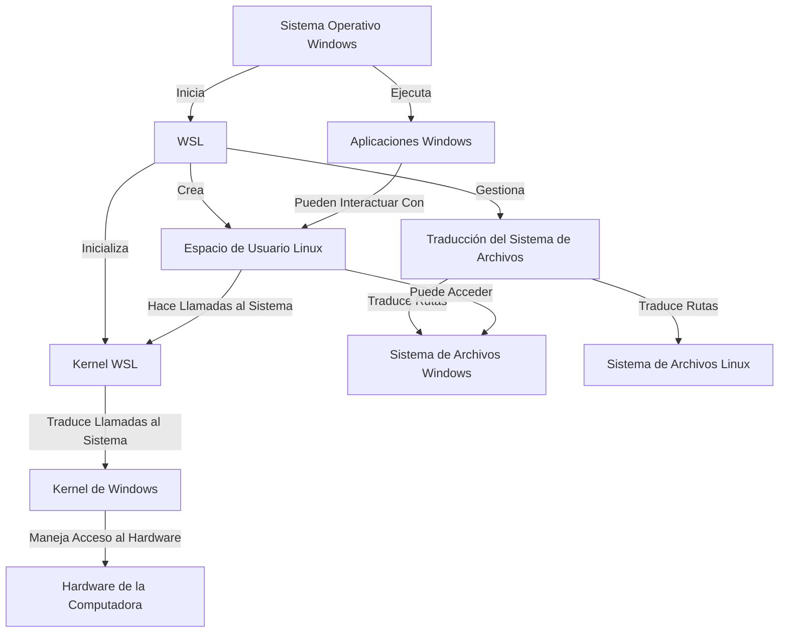

# Development on Linux Within Windows for Beginners: WSL

After years of juggling between Windows and Linux using various strategies to manage different operating systems (virtual machines, dual boot, containers), I bring you the option that outperformed all the others for setting up a quick and, above all, easy environment: Windows Subsystem for Linux (WSL).

This will be useful for you if:

- You need to quickly set up a Linux-compatible development environment from Windows with good performance.
- You want to learn how to use Linux but don’t feel confident enough to install everything manually on your machine.

## A Bit of History

Operating systems are installed on a computer's hard drive. Normally, only one is installed and runs on the machine; after that, there’s no need to interfere much. Traditionally, when someone starts developing in Linux, the first option is to install Linux by overwriting and deleting Windows. This option is not viable for someone who is just starting out, doesn’t have the confidence to tinker with their computer, isn’t interested in doing so, or shares the computer with others. However, it’s an excellent option for an old or repurposed PC.

The alternative is to have both, and the options then become:

- Dual boot (two operating systems on the same or different hard drives). This method clearly separates the operating systems at the cost of a slight delay when starting the PC to select the OS to boot.
- Using virtualization software to create a virtual machine where you can install the desired operating system. The host OS allocates dedicated resources to the guest OS, meaning these resources are no longer available to other programs running on the host system.

Both are feasible but not usually straightforward for someone just starting out.

The downside of the first option is that, depending on the hardware, you might face some challenges with the setup, especially if there’s only one disk for both OSs to coexist. Moreover, booting the PC takes a bit longer, which might be bothersome.

The downside of the second option is that virtual machines perform worse than the host OS and can take time to install and configure shared resources between systems. However, they offer the advantage of portability through virtual machine backups, though these can take up significant disk space.

Until 2016, one had no way around these options… until the first version of Windows Subsystem for Linux appeared. I discovered this solution around 2020, by which time version 2 had already been released, offering additional features and better performance than the classic WSL.

After trying all these options, I have no doubt that currently, it’s the best way to set up development environments for beginners and even more experienced users who want a fast setup from a fresh Windows installation.
How Does It Work?

I’ll show you with the following diagram:

## How to Install It?

For newer Windows versions, the setup is quite straightforward. Using the [official documentation](https://learn.microsoft.com/es-es/windows/wsl/setup/environment), here’s a step-by-step guide:

1. Open PowerShell and run the command wsl --install.

2. Open Ubuntu. Set a username and password for the Linux operating system. If this is your daily-use computer, the password doesn’t need to be overly complex.

In theory, these steps will have the machine running within Windows. We're ready to use it.

## How to Use It?

### Terminal Access

From PowerShell, you can now open a new tab and select the operating system you want to access.

In a terminal, programs are executed, which is the equivalent of double-clicking an icon in a visual interface. This is a purely text-based, lower-level interface. Within PowerShell, you run Windows programs inside Windows, while in the terminal of Ubuntu, Debian, or any other installed system, Linux programs are executed in their respective environments running within the system.

### Automatic Integration with VSCode

In my opinion, the best feature is the ability to open VSCode from the main operating system (Windows), which connects and treats WSL as a remote server. Simply put, it connects automatically, and every file you modify or code you execute or compile is done inside WSL, but the visual interface remains in Windows. It runs faster.

To open a directory in VSCode from the terminal, you just need to run *code .* within the WSL directory where you want to develop. This means: "Run the code program in the current directory (represented by the .)."

### Where Are All the Files?

From Windows Explorer, you can find all the files of the newly installed operating system. To open the current Linux directory from the Ubuntu terminal, for example, you can run the command *explorer.exe .*. This tells the computer: "Run the `explorer.exe` program in the current directory (represented by the .)."

Sources:

- [Microsoft WSL](https://learn.microsoft.com/es-es/windows/wsl/)
- [Wikipedia WSL](https://en.wikipedia.org/wiki/Windows_Subsystem_for_Linux)